# 跨平台输入法完整设计方案

> 版本：1.9  
> 范围：Android + iOS + 鸿蒙（HarmonyOS NEXT）+ **Windows + macOS + Linux** 六端，核心 **Rust**，架构与能力设计（不含业务代码实现）  
> 变更：v1.9 桌面端（Win/macOS/Linux）；v1.8 手写板输入；v1.7 AI 场景助手；v1.6 鸿蒙对接；v1.5 Rust 三端对接教程；v1.4 语言包创作规范；v1.3 语言包 OTA；v1.2 Rust 核心；v1.1 Session 安全隔离

---

## 1. 目标与约束

### 1.1 产品目标

- 提供高性能、可扩展的跨平台输入法，核心逻辑 **六端复用**（移动三端 + 桌面三端）。
- 支持键盘/方案切换、皮肤更换、候选提示、**手写板输入**、AI 润色、**AI 场景助手**（智能回复、高情商话术、谈判/恋爱/朋友圈等）等核心能力。
- 支持 **语言包（LangPack）OTA**：远程下载、启用/禁用，无需更新 IME App 即可新增语言输入能力。
- 在系统输入法框架约束下保证跟手性与稳定性。

### 1.2 性能指标

| 指标 | 目标 |
|------|------|
| 按键 → 首候选 P95 | ≤ 16ms（中端机） |
| 按键 → 首候选 P99 | ≤ 32ms |
| 方案/布局切换 | ≤ 50ms 完成 UI 重载 |
| 皮肤切换（已缓存） | ≤ 100ms 完成 token 应用 |
| 语言包 enable（已缓存） | ≤ 200ms 完成注册与 mmap |
| AI 润色首包 | ≤ 2s（云）/ ≤ 500ms（端侧，视模型而定） |
| AI 场景助手首条候选 | ≤ 2.5s（云）/ ≤ 800ms（端侧模板） |
| AI 助手面板打开 | ≤ 100ms（纯 UI，无推理） |
| 手写板打开 | ≤ 100ms（纯 UI，无推理） |
| 手写单字识别 P95 | ≤ 120ms（端侧） |
| 手写连写云识别 P95 | ≤ 800ms（云，Normal） |

### 1.3 平台约束

**Android**

- 基于 `InputMethodService` + `InputConnection`。
- 需处理竖屏/全屏/悬浮、拼写中状态、批量编辑。
- 键盘进程内存建议控制在 80MB 以内（含皮肤缓存）。

**iOS**

- 基于 `UIInputViewController`，运行在 Keyboard Extension 沙盒。
- 扩展进程内存上限约 50–60MB，超限会被系统终止。
- 词库/配置可通过 App Group 与主 App 共享。
- AI 模块、大皮肤包必须支持按需卸载。

**鸿蒙（HarmonyOS NEXT）**

- 基于 `InputMethodExtensionAbility` + `inputMethod.InputClient`（`@kit.IMEKit`）。
- UI 为 ArkUI（ArkTS）；原生胶水为 **NAPI C++** 转发至同一 `ime_hot.h` C ABI。
- Rust 产物为 `libime_ffi.so`（`aarch64-unknown-linux-ohos`），与 Android 同为 cdylib 链路。
- 语言包由主 `EntryAbility` 下载至 **应用级 `filesDir`**；输入法扩展只读挂载（模式同 Android `filesDir`）。
- 扩展进程内存建议 ≤ 80MB；`native_so` 引擎 OTA 策略同 Android（同 Bundle 签名）。

**Windows**

- 基于 **TSF**（Text Services Framework）`ITfTextInputProcessor` + `ITfThreadMgr`；**不推荐** 新实现 IMM32 遗留路径。
- 上屏经 `ITfContext` / `ITfInsertAtSelection`；`InputScope`（`ISF_*`）映射 `PrivacyLevel`。
- Rust 产物为 `ime_ffi.dll`（`cdylib`）；壳进程与 TIP 同进程或独立服务进程（推荐 **同进程** 减延迟）。
- 语言包、模型、配置目录：`%LOCALAPPDATA%\{AppName}\`（`langpacks/`、`models/`、`data/`）。
- 无移动 Extension 式内存上限；仍建议进程常驻内存 ≤ 150MB（含皮肤与多语言 mmap）。
- 支持物理键盘组合键（`Ctrl+Space` 切换、`Shift` 中英）与悬浮候选窗（TSF `ITfCandidateList` 或自绘 HWND）。

**macOS**

- 基于 **InputMethodKit**（IMK）：`IMKServer` + `IMKInputController` + `IMKCandidates`。
- 上屏经 `insertText(_:replacementRange:)` / `setMarkedText(_:selectedRange:replacementRange:)`。
- Rust 产物为 `libime_ffi.dylib`（`cdylib`）或静态库打进 `.app`；与 iOS 不同，**无 Keyboard Extension 沙盒**，能力与主 App 同级。
- 语言包目录：`~/Library/Application Support/{AppName}/langpacks/`。
- 支持菜单栏 IME 切换、触控板手写（系统笔迹可转交 `HandwritingService`）、深色模式跟随 `NSAppearance`。
- **允许** OTA 同签 `engine_native.dylib`（codesign Team ID 一致）；策略同 Android 可选原生引擎。

**Linux**

- 主适配 **IBus**（GNOME / 多数发行版默认）与 **Fcitx5**（KDE / 中文社区常用）；共享同一 `libime_ffi.so` + 薄插件壳。
- IBus：`IBusEngine` 子类；Fcitx5：`fcitx5::AddonInstance` + `InputMethodEngineV3`。
- 上屏经 `IBusEngine.commit_text` / `update_preedit`；Fcitx5 经 `InputContext` API。
- Rust 产物：`libime_ffi.so`（`x86_64-unknown-linux-gnu`、`aarch64-unknown-linux-gnu`）。
- 语言包目录：`$XDG_DATA_HOME/{app-id}/langpacks/`（默认 `~/.local/share/...`）。
- Wayland / X11 由 IBus/Fcitx 抽象焦点；自绘 UI 需注意 compositor 下 **layer-shell** 或框架内嵌面板。
- 无系统级 Extension 内存限制；建议常驻 ≤ 120MB。

### 1.4 隐私与安全

| 场景 | 策略 |
|------|------|
| 密码框 / 支付框 | `PrivacyLevel = ForbiddenCloud`：禁云、禁 AI、禁用户词上传 |
| 敏感输入（邮箱、电话等） | `PrivacyLevel = Sensitive`：禁云、禁学习上传，本地组词可用 |
| 普通文本 | `PrivacyLevel = Normal`：全能力可用，用户可配置关闭云 |

**Session 隔离（安全基线）**

- 架构强制 **「一个输入框 = 一个 Session」**，详见 [1.5 Session 安全模型](#15-session-安全模型)。
- composing、候选、AI 任务、引擎状态均 **Session 内隔离**，禁止跨输入框复用。
- 切换输入框时旧 Session **立即销毁并擦除** 敏感缓冲，防止密码框与普通框数据串用。

### 1.5 Session 安全模型

#### 1.5.1 隔离原则

| 原则 | 规则 |
|------|------|
| 一框一会话 | 每个输入框实例对应唯一 `Session`，含独立 composing、候选、Task 集合 |
| 单活跃 | 全局仅 **1 个 Active Session**；UI/Adapter 只 bind 当前活跃 `editor_id` |
| 切换即销毁 | 输入框切换：`stop(old)` → 擦除敏感缓冲 → `start(new)`，**禁止复用** 旧 `EditorId` |
| 隐私绑定 | `PrivacyLevel` 在 Session 创建时解析；Session 内 **不可升高权限**（如 Sensitive→Normal 云能力） |
| 结果归属 | 所有 Hot/Cold 回调必须带 `editor_id`；非 Active Session 的结果 **一律丢弃** |
| 无全局 composing | `InputEngine` 状态按 Session 分桶（`SessionEngineMap`），禁止进程级单例 composing |

#### 1.5.2 Session 状态机

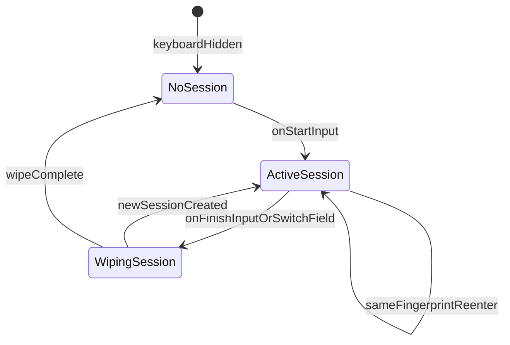

#### 1.5.3 EditorFingerprint（输入框身份）

用于判断「是否同一输入框」与安全审计：

```text
EditorFingerprint {
  package_name / bundle_id    // 宿主 App
  field_id: uint64             // Android: fieldId；iOS: 合成标识
  input_type: InputTypeFlags
  ime_options: uint32
  hint_hash: uint64            // hint/contentDescription 哈希，可选
}
```

| 场景 | 行为 |
|------|------|
| 同指纹重入 | 旋转/重建视图且系统未发 `onFinishInput`：可 **resume** 同 Session |
| 指纹变化 | 密码框↔普通框、换 App、换 fieldId：必须 `stop` + 新建 Session |
| EditorInfo 变严 | `onEditorInfoChanged`：仅允许 **降级** Session 能力（如 Normal→Sensitive） |

**平台采集**

- **Android**：`EditorInfo.fieldId`、`packageName`、`inputType`、`imeOptions`、`hint`。
- **iOS**：`bundleIdentifier` + `textDocumentProxy` 文档标识 + `keyboardType` + `returnKeyType` 合成 `field_id`。
- **鸿蒙**：`EditorAttribute.bundleName`、`inputType`、`enterKeyType` + 稳定实例哈希合成 `field_id`。
- **Windows**：`ITfContext` 文档 cookie + 焦点窗口 `HWND` + `InputScope` + 控件 `AutomationId` 哈希。
- **macOS**：`bundleIdentifier` + `client()` 文档标识 + `attribute(.inputContext)` + `selectedRange` 合成。
- **Linux**：IBus `unique_name` / Fcitx5 `InputContext` uuid + 窗口 `WId` + surrounding text 哈希。

#### 1.5.4 SessionManager 与 ImeSession

`SessionManager` 归属 `ime-session`，管理 Session 全生命周期：

| API | 说明 |
|-----|------|
| `create(fingerprint, EditorInfo) -> EditorId` | 创建 Session，解析 PrivacyLevel |
| `activate(editor_id)` | 设为唯一 Active |
| `getActive() -> EditorId?` | 获取当前活跃 Session |
| `stop(editor_id, reason)` | 取消 Task、secure wipe、从表移除 |
| `stopAll()` | 键盘 hide / 进程回收 |
| `validate(editor_id) -> bool` | 回调入口校验：存在且为 Active |
| `onEditorInfoChanged(editor_id, info)` | inputType 变严时降级能力 |

每个 Session 独立持有：

```text
ImeSession {
  editor_id: EditorId
  fingerprint: EditorFingerprint
  privacy_level: PrivacyLevel
  input_mode: InputMode
  engine_state: EngineState      // InputEngine 分桶状态
  composing: ComposingText
  candidates: Candidate[]
  seq: uint64
  task_ids: TaskId[]
  created_at, last_active_at
}
```

**销毁擦除**：`stop` 时对 `composing`、候选缓存、AI 中间结果执行 **secure wipe**（Rust `zeroize` crate 标记敏感类型并在 Drop 时清零），再释放内存。

#### 1.5.5 跨模块安全边界

| 模块 | Session 约束 |
|------|-------------|
| UiBinder | 仅 `bind(active_editor_id)`；`onSnapshot` 校验 `editor_id == getActive()` |
| PlatformAdapter | `submitHot` / `invokeCold` 拒绝非 Active `editor_id`，返回 `SessionInvalid` |
| InputEngine | 所有操作带 `editor_id`，内部 `SessionEngineMap`，无全局 composing |
| AiService | `TaskReq.editor_id` 必填；完成时 `validate` 通过才回调 UI |
| Lexicon | 核心词库全局只读；**用户词学习** 受 Session `privacy_level` 门控 |
| Repository/Sync | 禁止携带 Session composing/明文；同步仅元数据且 privacy 允许 |
| PluginHost | 语言包安装/enable 为 P3；disable 当前 lang 时清空 Session composing |

---

## 2. 总体架构

### 2.1 分层架构图

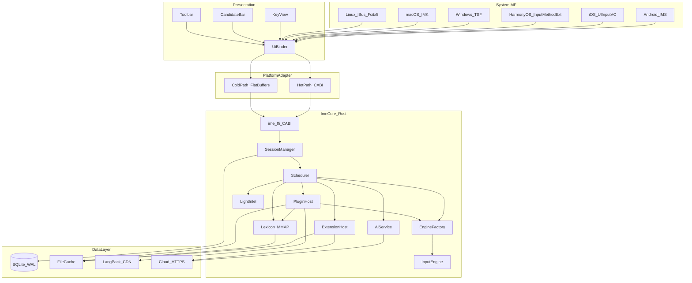

### 2.2 分层职责

| 层级 | 职责 | 禁止 |
|------|------|------|
| System IMF | 生命周期、InputConnection、系统 API 上屏 | 业务算法 |
| Presentation | 触摸、绘制、动画、主题 token 渲染 | 组词、词库查询、JSON 解析 |
| Platform Adapter | 热/冷双通道 FFI、线程切换、任务取消；Android JNI / iOS Swift / 鸿蒙 NAPI / **Win TSF C++ / macOS Swift+IMK / Linux GObject 插件** 胶水 | 业务状态机 |
| Ime Core (Rust) | 组词、调度、AI、扩展逻辑；经 `ime-ffi` 暴露 C ABI | 持有 View / 平台控件 |
| Data Layer | 持久化、同步、CDN 下载 | 阻塞热路径 |

### 2.3 通信通道

**热路径（Hot Path）**

- 用途：按键 → 候选 → 预上屏 / 上屏。
- 协议：C ABI + 定长结构 / 共享内存环形缓冲。
- **禁止** Protobuf / FlatBuffers。

**冷路径（Cold Path）**

- 用途：皮肤包、配置同步、云词库增量、AI 请求体、**语言包下载**。
- 协议：FlatBuffers（推荐）；必要时 Protobuf。
- Rust 侧在 **Tokio 运行时**（独立 IO 线程）执行，不阻塞热路径。

### 2.4 Rust 核心技术栈

> **双端对接与分步教程**：[RUST_PLATFORM_INTEGRATION.md](RUST_PLATFORM_INTEGRATION.md)

核心模块统一使用 **Rust** 实现，编译为静态库 / cdylib，经 **C ABI** 供 Kotlin（Android JNI）、Swift（iOS / macOS）、ArkTS（鸿蒙 NAPI）、**C++（Windows TSF / Linux IBus·Fcitx5）** 调用。

| 领域 | Crate / 工具 | 说明 |
|------|-------------|------|
| Workspace | Cargo workspace | 多 crate 拆分，见第 9 章 |
| FFI 导出 | `ime-ffi` + **cbindgen** | 生成 `ime_hot.h`，热路径 C ABI |
| Android 胶水 | `jni` crate + Kotlin `ImeNative` | `libime_ffi.so`（cargo-ndk）；详见对接教程 4 节 |
| iOS 胶水 | Swift + Bridging Header | `ime_ffi.xcframework` 静态库；详见对接教程 5 节 |
| 鸿蒙胶水 | NAPI C++ + ArkTS `ImeNative` | `libime_ffi.so`（OHOS NDK）；详见对接教程 6 节 |
| **Windows 胶水** | **C++ TSF + `ime_hot.h`** | **`ime_ffi.dll`**（`x86_64-pc-windows-msvc`）；详见对接教程 7 节 |
| **macOS 胶水** | **Swift + InputMethodKit** | **`libime_ffi.dylib`** 或静态库；详见对接教程 8 节 |
| **Linux 胶水** | **C IBus/Fcitx5 插件 + `ime_hot.h`** | **`libime_ffi.so`**；详见对接教程 9 节 |
| 敏感数据擦除 | `zeroize` | Session stop 时清零 composing/AI 缓冲 |
| 词库 MMAP | `memmap2` | 核心词库只读映射 |
| 本地存储 | `rusqlite` | SQLite WAL，仅 IO 线程 |
| 异步 IO | `tokio` | 云同步、CDN、语言包下载、AI HTTP；冷路径专用 |
| FlatBuffers | `flatbuffers` | 皮肤包、**语言包 manifest**、配置解析 |
| HTTP | `reqwest` | AiService / Repository / PluginHost 云请求 |
| 插件验签 | `ed25519-dalek` 等 | 语言包 `.imepack` 签名验证 |
| 错误处理 | `thiserror` / `Result` | 跨 FFI 映射为错误码 |

**Rust 边界原则**

- 热路径函数保持 **`#[no_mangle] extern "C"`**，参数为定长 struct / 原始指针，避免跨 FFI 传递 Rust 对象。
- 冷路径可在 Rust 内部使用 trait / async，结果经 channel 回调至平台主线程。
- **禁止** 在 FFI 边界使用 Panic 传播；`ime-ffi` 统一 catch 并返回 `IME_ERR_INTERNAL`。
- `Send + Sync`：SessionManager 等共享状态用 `Arc<Mutex<>>` 或专用 engine 线程 + 消息队列。

```text
Kotlin / Swift / ArkTS / C++ UI
  → Platform Adapter (JNI / Swift / NAPI / TSF·IMK·IBus)
  → ime-ffi (C ABI, cbindgen)
  → ime-session / ime-engine / ime-plugin / … (纯 Rust)
```

**语言包 OTA 边界**

- **ExtensionHost**：表情、皮肤、语音听写（App 内置，非 OTA 语言包）。
- **PluginHost**：语言包 Catalog、下载、验签、enable/disable。
- **iOS**：主 App 下载语言包至 App Group；Keyboard Extension **只读**共享目录。
- **鸿蒙**：主 `EntryAbility` 下载至 `applicationContext.filesDir`；`InputMethodExtensionAbility` **只读**同路径。
- **Windows / macOS / Linux**：主 App / 设置守护进程负责 `install`；IME 进程 **读写** 同一用户数据目录（无移动 Extension 只读分裂）。

---

## 3. 核心能力设计

### 3.1 键盘 / 输入方案切换

#### 3.1.1 概念模型

三类独立但可组合的状态：

| 概念 | 说明 | 示例 |
|------|------|------|
| `KeyboardLayout` | UI 布局（按键排列） | QWERTY、26 键、9 键、数字、符号、表情面板 |
| `InputScheme` | 输入引擎方案 | 全拼、双拼、五笔、手写、语音 |
| `Language` | 语言模式 | 中文、英文 |

组合状态 `InputMode`：

```text
InputMode {
  layout: KeyboardLayout
  scheme: InputScheme
  lang: Language
  ascii_mode: bool        // 中英切换
  forced_by_editor: bool  // 是否被 EditorInfo 强制
}
```

#### 3.1.2 状态持有与切换流程

- `SessionManager` 为每个 `editor_id` 持有独立 `InputMode`；全局仅一个 Active Session。
- 切换触发源：工具栏按钮、长按地球键、滑动切换、系统 `EditorInfo` 强制。
- 切换步骤：
  1. `SessionManager.validate(editor_id)` → `Scheduler.switchLayout()` / `switchScheme()` / `toggleAscii()`
  2. `InputEngine.reset()` 或 `switchScheme()` 清空 composing
  3. 产出 `UiCommand.ReloadKeyboard(layout)` + 新 `ImmSnapshot`
  4. `Repository.setConfig()` 异步持久化用户偏好

#### 3.1.3 EditorInfo 强制规则

| EditorInfo | 行为 |
|------------|------|
| `TYPE_CLASS_NUMBER` | 强制 `layout = Numeric`，记录原 layout，离开后恢复 |
| `TYPE_TEXT_VARIATION_PASSWORD` | 强制 `PrivacyLevel = ForbiddenCloud`，可选强制 ASCII |
| `TYPE_TEXT_VARIATION_EMAIL_ADDRESS` | 强制 `PrivacyLevel = Sensitive` |

#### 3.1.4 接口

```text
Scheduler.switchLayout(editor_id, layout) -> HotOutcome
Scheduler.switchScheme(editor_id, scheme) -> HotOutcome
Scheduler.toggleAscii(editor_id) -> HotOutcome
SessionManager.getInputMode(editor_id) -> InputMode
Scheduler.restoreUserPreference(editor_id)  // Editor 强制结束后
```

---

### 3.2 皮肤更换

#### 3.2.1 设计原则

- 皮肤解析在 **IO/扩展线程** 完成，UI 主线程只消费 `ThemeTokens`。
- 换肤 **不重置** `InputScheme` / composing 状态。
- 换 layout 时加载皮肤包中对应 layout 的资源子集。
- 失败自动回退默认皮肤，不影响组词。

#### 3.2.2 皮肤包结构

FlatBuffers 定义（概念）：

```text
SkinPack {
  id: string
  version: uint32
  name: string
  colors: ColorPalette       // 背景、按键、候选、高亮
  key_styles: KeyStyle[]     // 普通/按下/禁用态
  cand_style: CandStyle      // 候选栏字体、间距、选中态
  layouts: LayoutAssets[]    // 按 KeyboardLayout 索引的切图/九宫格
  sounds: SoundConfig[]      // 按键音效路径（可选）
  animations: AnimConfig[]   // 按键动画参数（可选）
}
```

大图（背景、按键切图）走文件系统缓存，FlatBuffers 只存路径索引。

#### 3.2.3 切换流程

```text
用户选择皮肤
  → ExtensionHost.open("theme")
  → ThemeRuntime.loadPack(skin_id)     // IO 线程，FlatBuffers 解析
  → ThemeTokens                        // 内存结构，供 UI 渲染
  → UiBinder.onThemeTokens(tokens)     // 主线程
  → KeyView / CandBar 重绘
  → Repository.setConfig(skin_id)      // 持久化
```

#### 3.2.4 接口

```text
ThemeRuntime.loadPack(skin_id) -> Result<ThemeTokens>
ThemeRuntime.apply(skin_id) -> TaskId           // 含下载
ThemeRuntime.current() -> ThemeTokens
ThemeRuntime.fallbackDefault() -> ThemeTokens
ExtensionHost.listSkins() -> SkinInfo[]
```

---

### 3.3 提示待选（候选栏）

#### 3.3.1 数据结构

```text
Candidate {
  id: uint32
  text: string
  source: Lexicon | User | Hot | AI | Emoji
  score: float
  extra?: { pinyin, comment, emoji_url }
}

ImmSnapshot {
  editor_id: EditorId
  seq: uint64              // 单调递增，UI 丢弃过期帧
  input_mode: InputMode
  composing: ComposingText
  candidates: Candidate[]
  cand_page: uint32        // 当前页
  cand_total_pages: uint32
  status_flags: uint32     // 简繁、候选展开等
}
```

#### 3.3.2 候选生成链路（P0 + P1）

```text
KeyPress
  → InputEngine.feed(key)
  → EngineStep { composing, LexQuery }
  → Lexicon.lookup(query)           // 同步 MMAP，无 SQL
  → [可选] LightIntel.rerank(cands) // 限时 2–4ms，超时跳过
  → ImmSnapshot { candidates, seq++ }
  → UiBinder.onSnapshot             // 主线程渲染
```

#### 3.3.3 展示策略

| 规则 | 说明 |
|------|------|
| 首屏优先 | 前 N 条（默认 5–9）仅来自 Lexicon/User/Hot |
| AI 后置 | AI 候选以低 score 合并进 **后续 seq 帧**，不替换首帧 |
| 分页 | 滑动/点击翻页触发 `InputEngine.suggestMore(page)` |
| 过期丢弃 | UI 比较 `seq`，旧帧不覆盖新帧 |
| 空候选 | 显示 composing 拼音串；超时降级 ASCII 直通 |

#### 3.3.4 交互与上屏

```text
SelectCandidate(id)
  → InputEngine.select(id)
  → Lexicon.touchUserWord(text)
  → UiCommand.Commit(text) + FinishComposing
  → Lexicon.addUserWord(text)       // 异步，不挡上屏
  → Lexicon.flushUserAsync()        // IO 线程落盘
```

#### 3.3.5 接口

```text
InputEngine.feed(editor_id, KeyEvent) -> EngineStep
InputEngine.select(editor_id, candidate_id) -> EngineStep
InputEngine.suggestMore(editor_id, page) -> Candidate[]
Lexicon.lookup(LexQuery) -> Candidate[]           // 同步
LightIntel.rerank(candidates, ctx) -> Candidate[] // 限时
```

---

### 3.4 AI 润色

#### 3.4.1 设计原则

- **非每键触发**：用户主动选择已上屏文本或点击工具栏「润色」。
- **P2 异步旁路**：绝不阻塞 P0 按键路径。
- **可取消**：Session `stop` / 用户取消时批量 cancel 该 Session 下全部 TaskId。
- **隐私门禁**：密码/支付场景直接拒绝；结果回调前 `SessionManager.validate(editor_id)`。

#### 3.4.2 触发入口

| 入口 | 说明 |
|------|------|
| 选区润色 | 用户在宿主 App 选中文本 → 工具栏「润色」 |
| 候选润色 | 长按候选词 → 「润色此词」 |
| 句末建议 | composing 完成后可选展示润色候选（P2，低优先级） |

#### 3.4.3 执行流程

```text
用户触发润色
  → SessionManager.privacyOf(editor_id)
  → AiService.isAllowed(privacy, budget)
  → [拒绝] UiCommand.ShowToast("当前场景不支持")
  → [允许] AiService.polish(TaskReq) -> TaskId
  → [端侧] 本地模型推理
  → [失败/超时] 云 API（若 privacy 允许）
  → onResult(task_id, ...) 
  → SessionManager.validate(editor_id)   // 非 Active 则丢弃
  → Scheduler 合并进 ImmSnapshot（低优先级 seq）
  → UiCommand.ReplaceSelection(text) 或展示润色候选条
```

#### 3.4.4 配额与降级

| 限制 | 值 |
|------|-----|
| 单次润色文本长度上限 | 500 字 |
| 频控 | 10 次/分钟 |
| 端侧推理超时 | 500ms |
| 云 API 超时 | 5s |
| 无网 | 仅端侧；端侧不可用则 Toast 提示 |

#### 3.4.5 接口

```text
AiService.isAllowed(PrivacyLevel, ResourceBudget) -> bool
AiService.polish(TaskReq) -> TaskId
AiService.translate(TaskReq) -> TaskId
AiService.cancel(task_id)
AiService.onResult(task_id, Result<AiOutput>)

TaskReq {
  editor_id: EditorId
  text: string
  timeout_ms: uint32
  prefer: Local | Cloud | Auto
}
```

---

### 3.5 语言包 OTA 与拔插

#### 3.5.1 设计目标

- **语言包（LangPack）** 为唯一 OTA 插件单元，包含：**语言标识 + 输入方案 + 键盘布局 + MMAP 词库 + 可选热词/UI 文案**。
- 用户可从 **语言包商店** 远程下载、启用、禁用、卸载，**无需更新 IME App** 即可新增东南亚等语言输入能力。
- 下载/验签/安装为 **P3 冷路径**，不阻塞 P0 按键；enable 后切换语言为 P0 路径。
- **语音听写（ASR）不属于语言包 OTA**；若需语音，走 App 内置 `SpeechHost`（ExtensionHost 可选 feature），与语言包解耦。

#### 3.5.2 LangPack 包格式（`.imepack`）

```text
.imepack/
  manifest.fb          # FlatBuffers LangPackManifest
  assets/
    layouts/           # 各 InputScheme 对应 KeyboardLayout
    lexicon.dat        # MMAP 词库
    hotword.delta      # 可选热词增量
    strings/           # 可选工具栏/提示文案
  signature            # Ed25519/RSA 签名
```

**LangPackManifest（概念）**

```text
LangPack {
  id: string                    // e.g. "vi-v1", "th-v1"
  version: uint32
  min_host_version: string
  lang: Lang                    // vi, th, id, ms, my, km, lo, zh, en, ...
  display_name: string
  schemes: InputSchemeDesc[]    // telex, vni, thai, latin_predict, pinyin, ...
  layouts: LayoutAssets[]       // 各 scheme 对应键盘布局
  lexicon_path: string          // pack 内词库相对路径
  hotword_delta_path: optional
  ui_strings_path: optional
  engine: DataDriven | NativeSo // iOS 仅 DataDriven；Android / 鸿蒙 可选同签 cdylib
  permissions: string[]         // lexicon, layout
}
```

| 平台 | OTA 内容 | 说明 |
|------|---------|------|
| 六端 | manifest + 布局 + 方案描述 + MMAP 词库 | PluginHost + EngineFactory 加载 |
| Android / 鸿蒙 | 可选同签 `engine_native.so` | manifest 声明且签名与宿主一致 |
| iOS | **仅数据包** | Extension 禁止 OTA 加载未签名 dylib |
| **Windows / macOS / Linux** | **数据包 + 可选同签原生引擎** | 桌面无 Extension 限制；macOS 须 codesign Team ID 一致 |

#### 3.5.3 生命周期与拔插

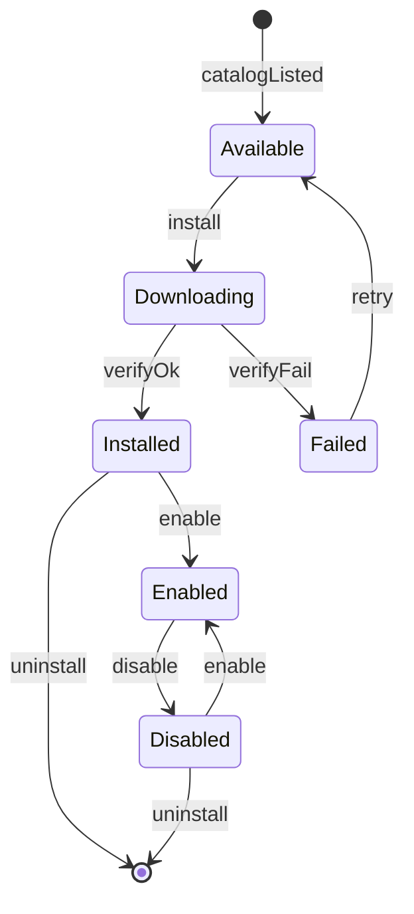

| 状态 | 说明 |
|------|------|
| Available | Catalog 可见，本地未安装 |
| Downloading | 下载中（可断点续传） |
| Installed | 已解压验签，未注册引擎 |
| Enabled | 已注册 LangPackSlot + EngineFactory + mmap；出现在语言切换列表 |
| Disabled | **拔插**：unregister + close mmap，**保留文件** |
| Failed | 验签/版本不兼容/磁盘错误 |

#### 3.5.4 PluginHost 组件

| 组件 | 职责 |
|------|------|
| CatalogClient | 拉取远程语言包清单（lang、version、url、hash、min_host_version） |
| DownloadManager | 断点续传、Wi-Fi 策略、队列、磁盘配额（建议上限 200MB） |
| SignatureVerifier | 验签 + hash；失败拒绝安装 |
| VersionGate | 宿主 `HOST_VERSION` ≥ pack `min_host_version` |
| PluginRegistry | 已安装/已启用语言包索引 |
| LangPackLoader | 解析 manifest、注册 EngineFactory、触发 Lexicon.open_lang |
| LangPackSlot | 当前已 enable 的语言包运行时视图 |

**iOS 分发**：主 App 负责 `install`；文件写入 **App Group 共享目录**；Keyboard Extension 内 PluginHost 以 **只读** 模式 `listInstalled` / `enable` 已下载包。

**鸿蒙分发**：主 `EntryAbility` 负责 `install`；文件写入 **`applicationContext.filesDir/langpacks/`**；`InputMethodExtensionAbility` 内 PluginHost **只读** enable。

**桌面分发**：主 App 或后台更新服务 `install` 至用户数据目录（见 1.3 节各平台路径）；TSF / IMK / IBus 引擎进程 **直接读写** enable，无需 App Group 式共享。

#### 3.5.5 与 Session / 键盘切换集成

```text
用户 enable 语言包
  → PluginHost.enable(pack_id)
  → LangPackLoader: EngineFactory.register + Lexicon.open_lang
  → 出现在 Toolbar / 地球键语言列表

用户 switchLang(pack_id) / switchScheme
  → Scheduler.switchLang / switchScheme
  → EngineFactory.create(lang, scheme)
  → InputEngine.reset(editor_id)
  → UiCommand.ReloadKeyboard + ImmSnapshot

用户 disable 语言包（拔插）
  → PluginHost.disable(pack_id)
  → EngineFactory.unregister + Lexicon.close_lang
  → 若当前 Session 正在使用该 lang：降级默认语言 + 清空 composing
```

#### 3.5.6 能力边界（不在语言包内）

| 能力 | 归属 |
|------|------|
| 语音听写 ASR | App 内置 SpeechHost（可选 feature），非 OTA 语言包 |
| 皮肤 Theme | ExtensionHost / ThemeRuntime |
| 表情 Emoji | ExtensionHost |

#### 3.5.7 东南亚语言包示例

| lang | 方案 | 包内容要点 |
|------|------|-----------|
| vi | Telex / VNI | 声调组合规则 + 越南词库 + Telex 键盘布局 |
| th | Thai | 泰语键盘 + 词典消歧（无空格分词） |
| id / ms | Latin | QWERTY + 预测词库 |
| my / km / lo | 各原生方案 | 专用布局 + 大字集词库 |
| zh / en | 拼音 / QWERTY | 可与 App 内置包并存；OTA 用于词库/热词增量 |

#### 3.5.8 接口

```text
PluginHost.fetchCatalog() -> TaskId
PluginHost.install(pack_id) -> TaskId
PluginHost.enable(pack_id) -> Result
PluginHost.disable(pack_id)                               // 拔插
PluginHost.uninstall(pack_id)
PluginHost.listInstalled() -> LangPackInfo[]
PluginHost.listEnabled() -> LangPackInfo[]

EngineFactory.register(manifest) -> Result
EngineFactory.unregister(pack_id)
EngineFactory.create(lang, scheme) -> InputEnginePlugin
EngineFactory.listSchemes(lang) -> InputSchemeDesc[]

Lexicon.open_lang(pack_id, path) -> LangLexiconHandle
Lexicon.close_lang(pack_id)

Scheduler.switchLang(editor_id, pack_id) -> HotOutcome
```

#### 3.5.9 开发者创作与源格式（摘要）

> **完整规范**：[LANGPACK_AUTHORING.md](LANGPACK_AUTHORING.md)

语言包采用 **「人读源格式 → `ime-tools` 编译 → 运行时二进制」** 流水线；开发者日常 **无需 Kotlin/Swift**。

| 资产 | 开发者编辑（源） | 编译产物（运行时） |
|------|------------------|-------------------|
| 包清单 | `pack.toml`（TOML） | `manifest.fb`（FlatBuffers） |
| 输入方案 | `schemes/*.yaml` + `rules/*.yaml` | `scheme/*.bin`（定长表，enable 时 mmap） |
| 键盘布局 | `layouts/*.yaml` | `layouts/*.bin`（`#[repr(C)]` KeySlot） |
| 词库 | `lexicon/*.tsv`（UTF-8 表头 TSV） | `lexicon/*.dat` 或 `*.fst`（**MMAP 热查询**） |
| UI 文案 | `strings/*.json` | `strings/*.fb`（FlatBuffers） |
| 热词 | `hotwords.csv` | `hotword.delta`（FlatBuffers，IO merge） |
| 皮肤（独立包） | `skin.toml` + 切图 | `.imeskin`（见 3.2） |

- **数据驱动（默认）**：`engine = data_driven`，仅 YAML/TOML/TSV/JSON。
- **原生引擎（可选）**：`engine = native_so`，Rust 实现 `InputEnginePlugin`，**Android / 鸿蒙**；iOS 仅数据包。
- **布局与皮肤解耦**：语言包定义逻辑键位；颜色/切图由 `.imeskin` 提供。
- **工具链**：`ime-pack validate | build`、`ime-lexicon compile` 等（Rust CLI，见创作规范第 12 节）。

---

### 3.6 AI 场景助手（智能回复与高情商）

> **场景与 Prompt 规范**：[AI_ASSIST_DESIGN.md](AI_ASSIST_DESIGN.md)

在 **3.4 AI 润色** 基础上扩展为 **AiAssistService**，提供场景化沟通辅助：谈判、客户跟进、恋爱聊天、朋友圈文案等。定位为 **P2 异步旁路**，**不阻塞 P0 组词**。

#### 3.6.1 设计原则

- **用户主动提供上下文**：选区文本 + AI 面板内手动填写「对方消息 / 背景 / 目的」；**禁止**自动读剪贴板、聊天历史、无障碍抓屏。
- **端云混合**：端侧 `PrivacyScrubber` 脱敏 + 短模板；复杂生成走云端 LLM（需 `PrivacyLevel` 允许）。
- **多候选**：默认生成 3 条 `AiSuggestionVariant`，用户点选后 `Commit` / `ReplaceSelection`。
- **不占用 P0 候选首屏**：建议仅在 `AiAssistPanel` 内展示（延续 3.3.3「AI 后置」原则）。
- **Session 隔离**：`TaskReq.editor_id` 必填；回调前 `validate`；`stop` 时 cancel 任务并 secure wipe 上下文。

#### 3.6.2 能力 `AiMode`

| AiMode | 用户意图 | 典型场景 |
|--------|----------|----------|
| `SmartReply` | 根据对方消息生成回复 | 微信聊天、客户跟进 |
| `HighEqReply` | 高情商、得体、不冒犯 | 道歉、拒绝、催款、恋爱试探 |
| `Compose` | 从零撰写 | 发朋友圈、开场白、谈判开场 |
| `Rewrite` | 改写已有草稿 | 语气太硬/太软、太长 |
| `Polish` | 保留原意优化表达 | 兼容 3.4 润色 |

#### 3.6.3 场景 `AiScene`

内置 `aipacks/default/`；M5 可 OTA **AiPack**（仅 prompt 模板，不含模型）：

| scene_id | 名称 | 要点 |
|----------|------|------|
| `negotiation` | 商务谈判 | 立场清晰、留余地、不激化 |
| `customer_followup` | 客户跟进 | 专业、有温度、促成交 |
| `dating` | 恋爱聊天 | 真诚、幽默、不过度 |
| `social_moment` | 朋友圈 | 吸睛但不尬、可配 emoji 建议 |
| `work_chat` | 职场沟通 | 简洁、礼貌、边界感 |
| `apology` | 道歉挽回 | 共情 + 承担 + 下一步 |
| `custom` | 自定义 | 用户描述目的 |

语气 `AiTone`：`Professional | Warm | Humorous | Concise | HighEq | Assertive`。

#### 3.6.4 用户上下文 `AiContextBundle`

```text
AiContextBundle {
  selection_text: optional string      // 宿主选区或 composing
  peer_message: optional string        // 用户粘贴「对方说了什么」
  background_note: optional string     // 谈判背景 / 关系阶段 / 禁忌
  user_intent: optional string         // 「想达成什么」
  target_length: Short | Medium | Long
}
```

#### 3.6.5 端云混合流水线

```text
GenerateAiAssist
  → SessionManager.privacyOf(editor_id)
  → AiAssistService.isAllowed(privacy, mode)
  → [拒绝] ShowToast
  → PrivacyScrubber.redact(bundle)
  → previewPayload() → 用户确认上云（可配置强制）
  → SceneRouter.pick(scene, mode)
  → [短模板] LocalTemplateEngine.generate()     // ≤800ms
  → [复杂] CloudLlmClient.stream()              // ≤2.5s 首条
  → validate(editor_id)
  → AiOutput { variants[3], disclaimer, used_cloud }
  → AiAssistPanel 展示卡片
  → SelectAiVariant → UiCommand.Commit / ReplaceSelection
```

#### 3.6.6 触发入口与 UI

| 入口 | 路由 |
|------|------|
| 工具栏「AI助手」 | `OpenAiAssist` → P3 `ExtensionHost.open("ai_assist")` |
| 面板内「生成建议」 | `GenerateAiAssist` → P2 `AiAssistService.suggest` |
| 选择候选卡片 | `SelectAiVariant` → P0 Commit |
| 关闭面板 | `DismissAiAssist` → P3 恢复 KeyView |
| 选区润色（兼容） | `PolishSelection` → P2 `AiAssistService.polish` |

面板规格见 [KEYBOARD_UI_DESIGN.md](KEYBOARD_UI_DESIGN.md) 第 10 节。

#### 3.6.7 配额与合规

| 限制 | 值 |
|------|-----|
| 单次上下文总长度 | 2000 字 |
| 云生成频控 | 10 次/分钟 |
| 云 API 超时 | 8s |
| 端侧模板超时 | 800ms |
| 免责声明 | 每条结果附「AI 生成，请核对后发送」 |
| 审计日志 | 仅本地记录次数/场景，不上传原文 |

#### 3.6.8 接口

```text
AiAssistService.isAllowed(PrivacyLevel, AiMode) -> bool
AiAssistService.suggest(TaskReq) -> TaskId
AiAssistService.polish(TaskReq) -> TaskId              // 兼容 3.4
AiAssistService.previewPayload(TaskReq) -> RedactedPreview
AiAssistService.cancel(task_id)
AiAssistService.onResult(task_id, editor_id, AiOutput)

TaskReq {
  editor_id: EditorId
  mode: AiMode
  scene: AiScene
  tone: AiTone
  context: AiContextBundle
  timeout_ms: uint32
  prefer: Local | Cloud | Auto
}

AiSuggestionVariant { id, text, tone, score, tags[] }
AiOutput { variants[3], disclaimer, used_cloud: bool }
```

#### 3.6.9 AiPack 场景包（M5，可选 OTA）

```text
.imeaipack/
  manifest.fb          # AiPackManifest: scenes[], prompts[], examples[]
  signature
```

与 LangPack 解耦；主 App 下载，Extension 只读。详见 [AI_ASSIST_DESIGN.md](AI_ASSIST_DESIGN.md)。

---

### 3.7 手写板输入（HandwritingPad）

> **专章规范**：[HANDWRITING_DESIGN.md](HANDWRITING_DESIGN.md)

在工具栏与 `InputScheme` 双入口下提供手写输入：**端侧识别为主**，连写低置信时可走云端（隐私门禁）。笔迹在 **抬笔** 时批量提交，**禁止**每采样点走 P0 热路径。

#### 3.7.1 双入口

| 入口 | 行为 |
|------|------|
| 工具栏「手写」 | `OpenHandwriting` → `HandwritingPad`，`layout_handwriting_pad` |
| 切换输入方案 | `SwitchScheme(handwriting)` → 同上，持久化用户偏好 |
| 返回键盘 | `DismissHandwriting` / `SwitchScheme(pinyin)` → 恢复上一 `layout` |

```text
InputMode {
  layout: layout_handwriting_pad   // 或 layout_26_pinyin
  scheme: handwriting              // 或 pinyin_full
  lang: zh
}
```

#### 3.7.2 笔迹 `StrokeBatch`

```text
StrokePoint { x: f32, y: f32, t: u64, pressure: f32 }   // 归一化 0..1
Stroke { points: StrokePoint[] }
StrokeBatch {
  editor_id, session_stroke_id,
  strokes: Stroke[],
  canvas_size: (w, h),
  writing_mode: SingleChar | Continuous
}
```

#### 3.7.3 识别结果

```text
HandwritingResult {
  candidates: Candidate[]          // source = Handwriting，5–9 条
  recognized_text: optional       // 连写整段
  confidence: f32
  used_cloud: bool
}
```

#### 3.7.4 端云混合流水线（P1，硬超时）

```text
RecognizeHandwriting（抬笔）
  → HandwritingService.recognize(StrokeBatch)
  → 预处理（平滑、重采样、归一化）
  → OnDeviceRecognizer.infer()              // P95 ≤ 120ms
  → if confidence < threshold && Continuous && cloud_allowed:
       CloudHwRecognizer.infer()           // P95 ≤ 800ms，上云前 RedactedPreview
  → validate(editor_id)
  → ImmSnapshot.candidates + seq++
  → SelectCandidate → Commit + clear 当前书写区
```

| 模式 | 说明 | 默认识别 |
|------|------|----------|
| `SingleChar` | 一字一框，抬笔识别 | 端侧 |
| `Continuous` | 多字连写 | 端侧；低置信走云 |

**模型**：App 内置 ONNX/TFLite，主 App 下载、Extension mmap；**不进 LangPack OTA**（同 ASR）。

#### 3.7.5 与 InputEngine 关系

- 手写 **不经过** 拼音 `feed()` / `Lexicon.lookup`
- 选候选后走统一 `UiCommand.Commit`
- Session `stop` 时 secure wipe 笔迹缓冲

#### 3.7.6 接口

```text
HandwritingService.begin(editor_id) -> HwSessionId
HandwritingService.pushBatch(editor_id, StrokeBatch)    // 缓存笔迹
HandwritingService.recognize(editor_id) -> TaskId
HandwritingService.clear(editor_id)
HandwritingService.undo(editor_id)
HandwritingService.cancel(task_id)
HandwritingService.isAllowed(PrivacyLevel) -> bool
HandwritingService.previewPayload(batch) -> RedactedPreview   // 连写上云前
HandwritingService.onResult(task_id, editor_id, HandwritingResult)
```

UI 规格见 [KEYBOARD_UI_DESIGN.md](KEYBOARD_UI_DESIGN.md) 第 12 节。

---

## 4. 优先级与仲裁（Scheduler）

Scheduler 在 `SessionManager.validate` 通过后执行路由；所有 `handle` 入口必须先校验 `editor_id` 为 Active Session。

### 4.1 优先级模型

| 优先级 | 能力 | 延迟预算 | 失败策略 |
|--------|------|----------|----------|
| P0 | 按键组词、候选首屏、上屏/回删、方案切换引擎复位 | 数 ms ~ 16ms | 降级 ASCII 直通 |
| P1 | 本地轻纠错/重排、**手写识别** | 硬超时 2–4ms（纠错）；手写 120ms 端侧 / 800ms 云 | 跳过或 Toast |
| P2 | AI 润色/场景助手/翻译/云推理 | 百 ms ~ s | 可取消，Toast 提示 |
| P3 | 皮肤、表情、**手写板/AI 面板**、扩展、语言包 | 不阻塞 | 失败回退/忽略 |

### 4.2 Scheduler 路由规则

```text
handle(editor_id, action):
  if not SessionManager.validate(editor_id): return Err(SessionInvalid)

  if action in [KeyPress, SelectCandidate, Backspace, SwitchLayout, SwitchScheme, SwitchLang]:
    route → P0 (EngineFactory + InputEngine + Lexicon)
  elif action in [LongPressCandidate]:
    route → P2 (AiAssistService.polish) if allowed
  elif action in [OpenHandwriting, DismissHandwriting]:
    route → P3 ExtensionHost.open/close "handwriting"
  elif action in [SwitchScheme] where scheme == handwriting:
    route → P3 + layout_handwriting_pad + ReloadKeyboard
  elif action in [PushStrokeBatch]:
    route → P1 HandwritingService（仅缓存笔迹）
  elif action in [RecognizeHandwriting, ClearHandwriting, UndoHandwriting]:
    route → P1 HandwritingService
  elif action in [OpenAiAssist, DismissAiAssist]:
    route → P3 (ExtensionHost.open/close "ai_assist")
  elif action in [OpenExtension, ApplySkin]:
    route → P3 (ExtensionHost)
  elif action in [InstallLangPack, EnableLangPack, FetchLangCatalog]:
    route → P3 (PluginHost)          // 下载/安装不阻塞 P0
  elif action in [GenerateAiAssist]:
    route → P2 (AiAssistService.suggest) after privacy check
  elif action in [SelectAiVariant]:
    route → P0 Commit / ReplaceSelection
  elif action in [PolishSelection]:
    route → P2 (AiAssistService.polish) after privacy check

  P1 仅在 P0 产出 candidates 后、返回 UI 前插入（限时）
  P2/P3 结果异步合并，不打断已返回的 P0 snapshot
  P2/P3 回调到达时再次 validate(editor_id)，失败则丢弃
```

### 4.3 Session 生命周期与安全

#### 创建与激活

```text
onStartInput(EditorInfo):
  fp = buildFingerprint(EditorInfo)
  if fingerprintChanged(activeSession, fp):
    SessionManager.stop(old_editor_id, SwitchField)
  editor_id = SessionManager.create(fp, EditorInfo)
  SessionManager.activate(editor_id)
  UiBinder.unbind(); UiBinder.bind(editor_id)
  Scheduler.handle(editor_id, Init)
```

#### 销毁与擦除

```text
onFinishInput / 切换输入框 / 键盘 hide:
  SessionManager.stop(editor_id, reason):
    1. cancel 该 Session 全部 TaskId（AI/下载/润色）
    2. InputEngine.reset(editor_id)
    3. secure wipe composing、candidates、AI 中间缓冲、AiContextBundle、StrokeBatch
    4. 从 Session 表移除，editor_id 永不再用
```

`SessionStopReason`：`FinishInput | SwitchField | KeyboardHide | EditorInfoDowngrade | ProcessRecycle`

#### 取消与合并

- UI 比较 `ImmSnapshot.seq`：旧 seq 的结果丢弃。
- P2 润色进行中用户按键：取消该 Session 下润色 TaskId，P0 正常响应。
- 冷路径回调（AI/皮肤）：必须 `validate(editor_id)`，否则静默丢弃，不更新 UI。
- **禁止** 将 Session A 的 composing/候选渲染到 Session B 的输入框。

---

## 5. 模块接口清单

### 5.1 公共类型

```text
EditorId            = opaque handle（单调递增，销毁后不复用）
TaskId              = opaque handle
EditorFingerprint   = { package, field_id, input_type, ime_options, hint_hash }
ImeSession          = { editor_id, fingerprint, privacy_level, input_mode, ... }
SessionStopReason   = FinishInput | SwitchField | KeyboardHide | EditorInfoDowngrade | ProcessRecycle
KeyCode / KeyEvent
InputTypeFlags      = text | password | email | number | ...
PrivacyLevel        = Normal | Sensitive | ForbiddenCloud

ComposingText       = { text, cursor, highlights[] }
Candidate           = { id, text, source, score, extra? }   // source: Lexicon|User|Hot|AI|Handwriting|Emoji
ImmSnapshot         = { editor_id, seq, input_mode, composing, candidates[], status_flags }
AiMode              = SmartReply | HighEqReply | Compose | Rewrite | Polish
AiScene             = negotiation | customer_followup | dating | social_moment | work_chat | apology | custom
AiTone              = Professional | Warm | Humorous | Concise | HighEq | Assertive
AiContextBundle     = { selection_text?, peer_message?, background_note?, user_intent?, target_length }
AiSuggestionVariant = { id, text, tone, score, tags[] }
AiOutput            = { variants[3], disclaimer, used_cloud }
StrokePoint         = { x, y, t, pressure }
Stroke              = { points[] }
StrokeBatch         = { editor_id, session_stroke_id, strokes[], canvas_size, writing_mode }
WritingMode         = SingleChar | Continuous
HandwritingResult   = { candidates[], recognized_text?, confidence, used_cloud }
UiCommand           = Commit | SetComposing | FinishComposing | DeleteSurrounding
                      | ReloadKeyboard | ApplyThemeTokens | ReplaceSelection
                      | OpenPanel | ClosePanel | ShowToast
LangPackState       = Available | Downloading | Installed | Enabled | Disabled | Failed
LangPackInfo        = { id, lang, version, state, display_name, size_bytes }
InputEnginePlugin   = trait（Rust）；按 lang/scheme 实现 feed/select
EngineError         = Cancelled | Timeout | Busy | Unsupported | SessionInvalid | PackInvalid | Internal
Result<T>           = Ok(T) | Err(EngineError)
```

### 5.2 ImeShell（系统壳，六端各自实现）

| 平台 | 壳实现 | 上屏 API |
|------|--------|----------|
| Android | `InputMethodService` | `InputConnection` |
| iOS | `UIInputViewController` | `textDocumentProxy` |
| 鸿蒙 | `InputMethodExtensionAbility` | `inputMethod.InputClient` |
| **Windows** | **TSF Text Input Processor** | **`ITfInsertAtSelection` / `ITfContext`** |
| **macOS** | **`IMKInputController`** | **`insertText` / `setMarkedText`** |
| **Linux** | **IBus `Engine` / Fcitx5 `InputMethodEngineV3`** | **`commit_text` / `update_preedit`** |

| 方法 | 说明 |
|------|------|
| `onStartInput(editor: EditorInfo) -> EditorId` | 构建 Fingerprint；指纹变化时先 `stop` 旧 Session，再 `create` 新 Session |
| `onStartInputView(...)` | 视图重建；指纹未变则 resume，变则 stop+create |
| `onFinishInput(editor_id)` | `SessionManager.stop(editor_id, FinishInput)` |
| `onUpdateSelection(...)` | 光标/选区变化，仅转发给 Active Session |
| `onConfigurationChanged(...)` | 旋转/分屏；指纹未变保留 Session |
| `dispatchKey(editor_id, KeyEvent)` | 硬件键；须为 Active `editor_id` |
| `execute(UiCommand)` | 调系统 API 上屏/删字；Commit 绑定当前 Active Session |

### 5.3 UiBinder（表示层）

| 方法 | 说明 |
|------|------|
| `bind(editor_id) / unbind()` | 仅 bind Active Session；切换时先 unbind 再 bind |
| `onSnapshot(ImmSnapshot)` | 校验 `editor_id == getActive()` 且 seq 最新后刷新 |
| `onThemeTokens(ThemeTokens)` | 换肤渲染（全局 token，不携带 Session 文本） |
| `emit(UserAction)` | 自动附带 Active `editor_id` 上行 Adapter |

`UserAction`：`KeyPress | KeyLongPress | SelectCandidate | PageCandidates | SwitchLayout | SwitchScheme | SwitchLang | ToggleAscii | OpenExtension | ApplySkin | InstallLangPack | EnableLangPack | DisableLangPack | OpenHandwriting | DismissHandwriting | PushStrokeBatch | RecognizeHandwriting | ClearHandwriting | UndoHandwriting | OpenAiAssist | GenerateAiAssist | SelectAiVariant | DismissAiAssist | PolishSelection | SoftAction`

### 5.4 PlatformAdapter

| 方法 | 通道 | 说明 |
|------|------|------|
| `submitHot(editor_id, UserAction)` | Hot / C ABI | 经 JNI/Swift 调用 `ime-ffi`；非 Active 返回 `SessionInvalid` |
| `invokeCold(req: ColdRequest) -> TaskId` | Cold / FB | Rust Tokio 线程执行；**req.editor_id 必填** |
| `cancel(task_id)` | 两者 | |
| `setThreadHooks(main_post, io_post)` | — | 平台注入 |

`ColdRequest`：`{ editor_id, kind: Skin|Sync|AiPolish|AiAssist|AiPackSync|HandwritingCloud|LangPackInstall|LangCatalog|..., payload }`

回调：`onHotResult(editor_id, seq, ImmSnapshot, UiCommand[])`、`onColdResult(task_id, editor_id, ColdResponse)` — 消费方须 `validate(editor_id)`

### 5.5 SessionManager

| 方法 | 说明 |
|------|------|
| `create(fingerprint, EditorInfo) -> EditorId` | 新建 Session，解析 PrivacyLevel，分配 engine 分桶 |
| `activate(editor_id)` | 设为唯一 Active |
| `getActive() -> EditorId?` | |
| `stop(editor_id, SessionStopReason)` | 取消 Task、secure wipe、移除 |
| `stopAll()` | 键盘 hide / 进程回收 |
| `validate(editor_id) -> bool` | 存在且为 Active |
| `onEditorInfoChanged(editor_id, info)` | 变严时降级，禁止升高权限 |
| `privacyOf(editor_id) -> PrivacyLevel` | |
| `getInputMode(editor_id) -> InputMode` | |

### 5.6 Scheduler

| 方法 | 说明 |
|------|------|
| `handle(editor_id, UserAction) -> HotOutcome` | validate 通过后路由 P0~P3 |
| `switchLayout / switchScheme / toggleAscii / switchLang` | 切换 InputMode；switchLang 从 LangPackSlot 取方案 |
| `restoreUserPreference(editor_id)` | Editor 强制结束后恢复用户偏好 |
| `budget() -> ResourceBudget` | 内存/CPU 配额 |

### 5.7 EngineFactory

| 方法 | 说明 |
|------|------|
| `register(manifest: LangPackManifest) -> Result` | enable 语言包时注册 |
| `unregister(pack_id)` | disable 时移除 |
| `create(lang, scheme) -> InputEnginePlugin` | 为 Session 创建引擎实例 |
| `listSchemes(lang) -> InputSchemeDesc[]` | 已启用语言包下的方案列表 |

### 5.8 InputEngine

| 方法 | 说明 |
|------|------|
| `reset(editor_id, scheme)` | 清空该 Session composing |
| `feed(editor_id, KeyEvent) -> EngineStep` | 按键；内部 SessionEngineMap |
| `select(editor_id, candidate_id) -> EngineStep` | 选词 |
| `backspace(editor_id) -> EngineStep` | |
| `switchScheme(editor_id, scheme) -> EngineStep` | |
| `suggestMore(editor_id, page) -> Candidate[]` | 翻页 |

### 5.9 Lexicon

| 方法 | 说明 |
|------|------|
| `open(core_path) / close()` | App 内置核心词库 MMAP |
| `open_lang(pack_id, path) -> LangLexiconHandle` | 语言包词库 mmap |
| `close_lang(pack_id)` | disable/uninstall 时释放 |
| `lookup(LexQuery) -> Candidate[]` | **同步，无 SQL**；按当前 lang 路由 |
| `addUserWord(word, ctx, privacy)` | 受 Session privacy 门控；ForbiddenCloud 不写 |
| `touchUserWord(word)` | 内存 + 异步落盘 |
| `importHotDelta(blob) -> Result` | 热词合并 |
| `flushUserAsync() -> TaskId` | IO 落盘 |

### 5.10 LightIntel（P1，可选）

| 方法 | 说明 |
|------|------|
| `correct(text, ctx) -> Candidate[]` | 限时 2–4ms |
| `rerank(candidates, ctx) -> Candidate[]` | 限时 |

### 5.11 AiAssistService（P2，扩展 ime-ai）

| 方法 | 说明 |
|------|------|
| `isAllowed(PrivacyLevel, AiMode) -> bool` | ForbiddenCloud 禁云；Sensitive 仅端侧模板 |
| `suggest(TaskReq) -> TaskId` | 场景助手多候选生成 |
| `polish / translate(TaskReq) -> TaskId` | 兼容 3.4 润色 |
| `previewPayload(TaskReq) -> RedactedPreview` | 上云前脱敏预览 |
| `cancel(task_id)` | |
| `onResult(task_id, editor_id, AiOutput)` | validate 通过后交付 UI |

### 5.12 ExtensionHost（P3）

| 子模块 | 方法 |
|--------|------|
| ThemeRuntime | `loadPack`, `apply`, `current`, `fallbackDefault`, `listSkins` |
| AiAssistPanel | `open`, `close`, `onVariants`, `onPreviewConfirm`（`ai_assist`） |
| HandwritingPad | `open`, `close`, `onStrokes`, `onRecognize`, `onResult`（`handwriting`） |
| EmojiService | `search`, `ensureDownloaded`, `mapUnicode` |
| FontService | `resolveFont`, `requestAiGlyph` |
| SpeechHost | `start`, `pushAudio`, `stop -> text`（语音听写，App 内置） |

### 5.13 HandwritingService（P1，ime-handwriting / ime-ext）

| 方法 | 说明 |
|------|------|
| `begin(editor_id) -> HwSessionId` | 打开手写会话 |
| `pushBatch(editor_id, StrokeBatch)` | 缓存笔迹（不识别） |
| `recognize(editor_id) -> TaskId` | 抬笔触发 |
| `clear / undo(editor_id)` | 清空 / 撤销上一笔 |
| `cancel(task_id)` | |
| `isAllowed(PrivacyLevel) -> bool` | Sensitive 禁云；ForbiddenCloud 可禁面板 |
| `previewPayload(batch) -> RedactedPreview` | 连写上云前 |
| `onResult(task_id, editor_id, HandwritingResult)` | validate 后更新 CandBar |

### 5.14 PluginHost（P3，语言包 OTA）

| 方法 | 说明 |
|------|------|
| `fetchCatalog() -> TaskId` | 拉远程语言包清单 |
| `install(pack_id) -> TaskId` | 下载 + 验签 + 解压 |
| `enable(pack_id) -> Result` | 注册 EngineFactory + Lexicon.open_lang |
| `disable(pack_id)` | 拔插：unregister，保留文件 |
| `uninstall(pack_id)` | 删除文件；若 Enabled 先 disable |
| `listInstalled() -> LangPackInfo[]` | |
| `listEnabled() -> LangPackInfo[]` | 语言切换列表数据源 |

### 5.15 Repository / SyncWorker

| 方法 | 说明 |
|------|------|
| `getConfig / setConfig` | 用户偏好 |
| `loadUserLexMeta / saveUserLexMeta` | SQLite |
| `enqueueSync(SyncJob)` | 云词库/漫游；**不含 Session composing 明文** |
| `fetchCdn(url, path) -> TaskId` | 皮肤/表情；语言包由 PluginHost 专用队列 |
| `saveLangPackMeta / loadLangPackMeta` | 已安装语言包元数据 |
| `runAiHttp(req) -> TaskId` | 仅 AiService 调用 |
| `SyncWorker.tick(constraints)` | 空闲/Wi-Fi/充电策略 |

---

## 6. 关键时序

### 6.1 按键 → 候选 → 上屏

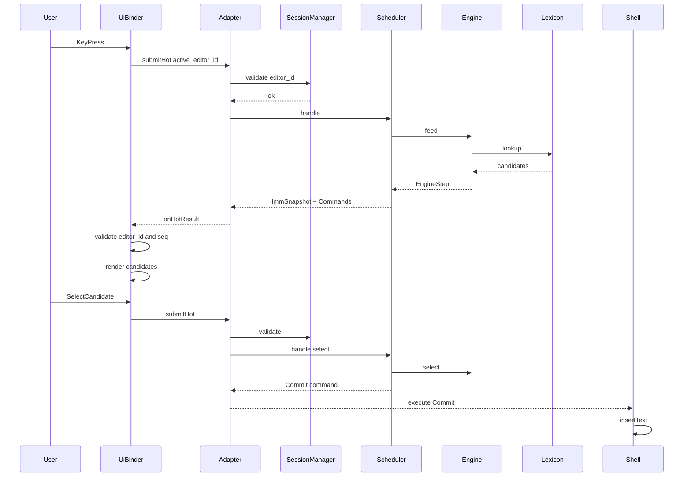

### 6.2 方案/布局切换

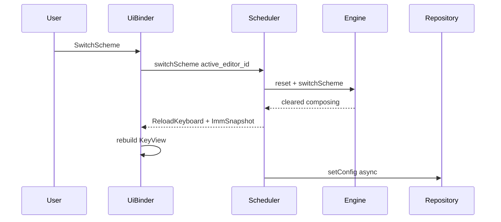

### 6.4 AI 润色（含隐私拒绝）

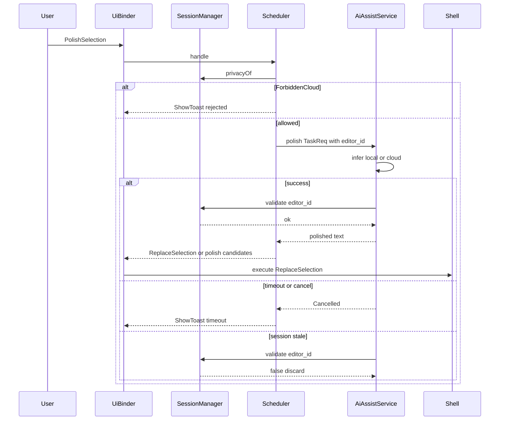

### 6.5 输入框切换 Session 隔离

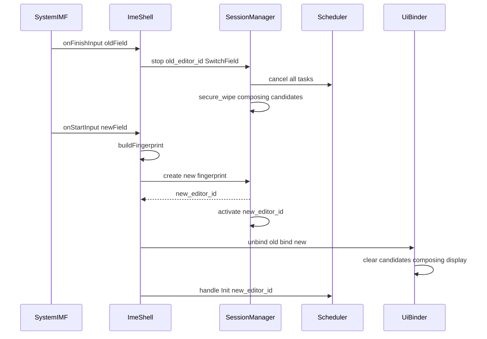

### 6.3 皮肤更换

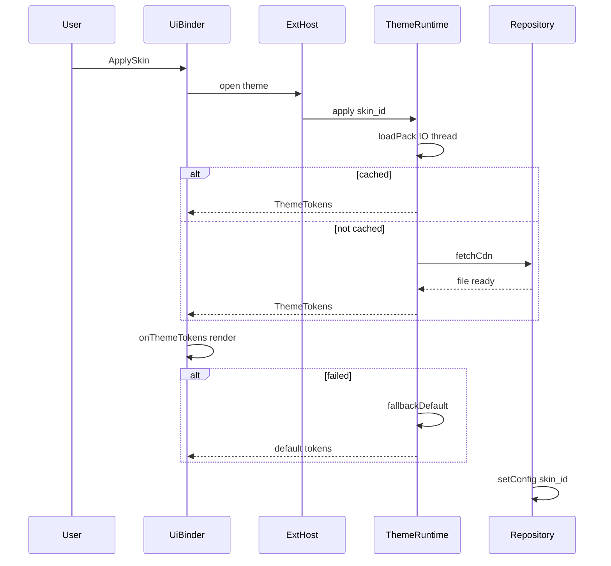

### 6.6 远程安装语言包

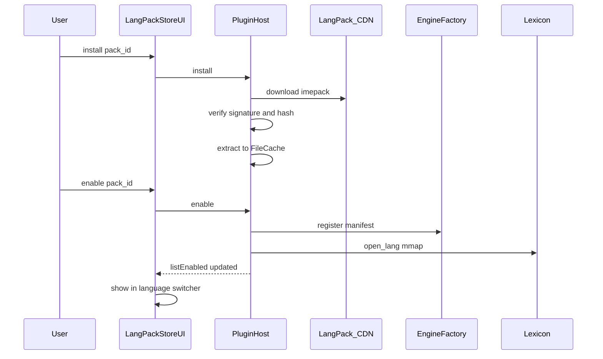

### 6.7 拔插语言包（disable）

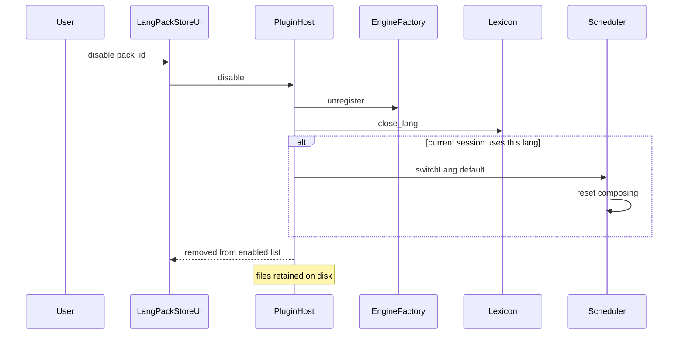

### 6.8 切换已启用语言

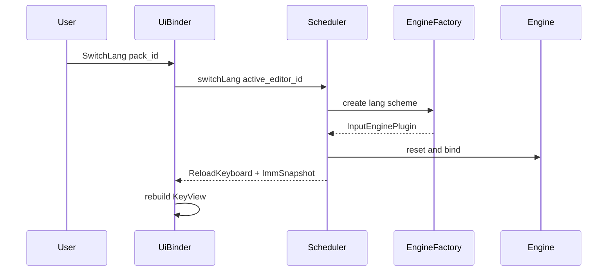

### 6.9 AI 场景助手（含上云确认）

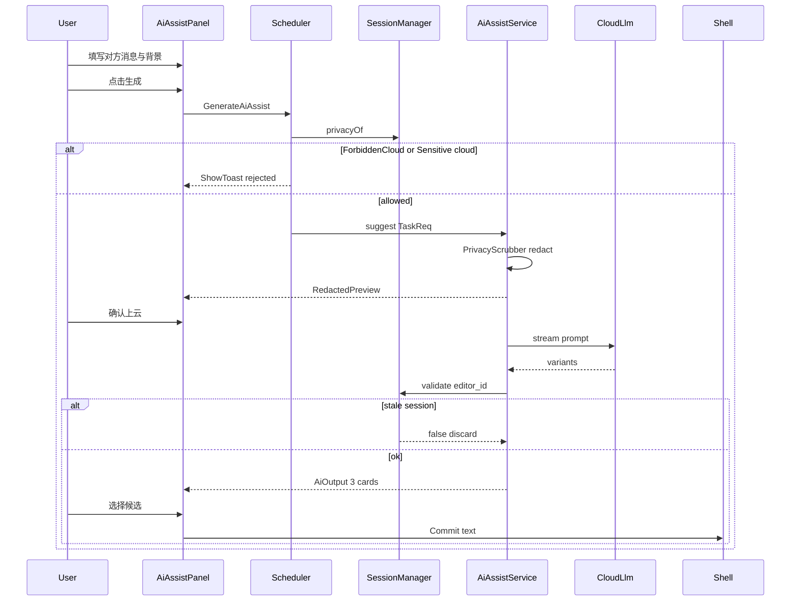

### 6.10 手写识别

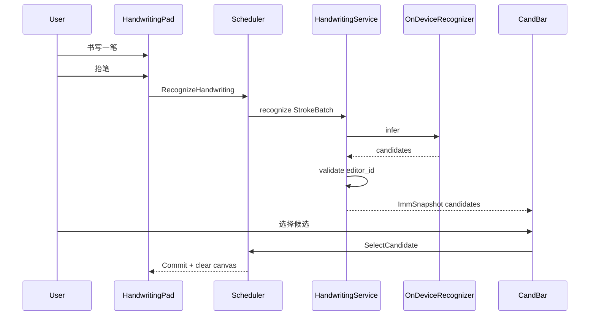

---

## 7. 数据与配置

### 7.1 本地存储

| 类型 | 存储 | 访问方式 |
|------|------|----------|
| 语言包（LangPack） | 文件系统 `langpacks/{id}/` | PluginHost；iOS App Group 共享 |
| 语言包元数据 | SQLite | pack_id、version、state、install_path |
| 核心词库（内置） | MMAP 文件（DAT/FST） | Lexicon 热路径只读 |
| 用户词元数据 | SQLite WAL | Repository，IO 线程 |
| 用户偏好 | SQLite | layout/scheme/skin_id/lang/enabled_lang_packs |
| 皮肤包 | 文件系统缓存 | ThemeRuntime，按需下载 |
| 表情/字体 | 文件系统缓存 | ExtensionHost |
| AI 模型（端侧） | 文件系统 | AiAssistService，按需加载/卸载 |
| AiPack 场景包 | 文件系统 `aipacks/{id}/` | AiAssistService；主 App 下载，Extension 只读 |
| 手写识别模型 | 文件系统 `models/handwriting/` | HandwritingService；主 App 下载，Extension mmap |

### 7.2 SQLite 表（概念）

```sql
user_words (word, pinyin, freq, created_at, synced)
user_config (key, value)          -- skin_id, layout, scheme, lang, enabled_packs
lang_pack (pack_id, lang, version, state, install_path, enabled, updated_at)
download_tasks (id, url, path, status, progress, kind)  -- kind: skin|langpack|...
sync_cursor (domain, last_sync_at)
lang_catalog_cache (fetched_at, blob)   -- 可选：Catalog 本地缓存
```

### 7.3 语言包目录布局

```text
{data_dir}/
  langpacks/
    vi-v1/
      manifest.fb
      assets/lexicon.dat
      assets/layouts/...
      signature
    th-v1/
      ...
  catalog/
    index.fb                 -- 最近一次 Catalog 快照
```

**iOS App Group**：主 App 写入 `{AppGroup}/langpacks/`；Extension 只读挂载。

### 7.4 云端服务

| 服务 | 协议 | 触发 |
|------|------|------|
| 语言包 Catalog CDN | HTTPS | 用户打开语言包商店 / 后台检查更新 |
| 语言包 `.imepack` CDN | HTTPS | PluginHost.install |
| 云词库增量 | HTTPS | SyncWorker 空闲 |
| 皮肤 CDN | HTTPS | 用户选择未缓存皮肤 |
| AI 润色 API | HTTPS | 用户触发，端侧失败时 |
| 手写连写云识别 API | HTTPS | Continuous 低置信 + Normal |
| 配置漫游 | HTTPS | 登录用户，SyncWorker |

### 7.5 SyncWorker 策略

- 仅在 Wi-Fi + 充电/空闲时上传用户词。
- `PrivacyLevel != Normal` 时暂停上传。
- 失败指数退避，不阻塞键盘。

---

## 8. 非功能需求与测试

### 8.1 性能

| 场景 | 验收 |
|------|------|
| 连续按键 100 次 | P95 ≤ 16ms，无掉帧 |
| 方案切换 | UI 重载 ≤ 50ms，composing 清空 |
| 皮肤切换（已缓存） | ≤ 100ms |
| 语言包 enable | ≤ 200ms（已安装） |
| 语言包下载 | 不阻塞按键；进度 UI 异步 |

### 8.2 内存（iOS 重点）

| 模块 | 预算 | 可卸载 |
|------|------|--------|
| 核心引擎 + 词库 MMAP | ~20MB | 否 |
| UI + 默认皮肤 | ~10MB | 否 |
| 扩展皮肤缓存 | ~15MB | 是 |
| AI 端侧模型 | ~20MB | 是 |
| 已 enable 语言包 mmap | ~5–15MB/包 | disable 可 unload |
| 语言包磁盘缓存 | ~200MB 上限 | LRU 卸载 Installed 未 Enabled |

| 表情/字体缓存 | ~10MB | 是 |

### 8.2.1 语言包 OTA 平台约束

| 约束 | Android | iOS | 鸿蒙 | Windows | macOS | Linux |
|------|---------|-----|------|---------|-------|-------|
| 下载发起 | 主 App 或 IME（可配置） | **仅主 App** | **仅主 EntryAbility** | **主 App / 更新服务** | **主 App** | **主 App / 包管理器插件** |
| IME 读取 | 直接读安装目录 | **App Group 共享目录** | **`applicationContext.filesDir`** | **`%LOCALAPPDATA%`** | **`Application Support`** | **`$XDG_DATA_HOME`** |
| OTA 原生引擎 | 可选同签 `.so` | **禁止**；仅 DataDriven | 可选同 Bundle 签 `.so` | 可选同签 `.dll` | 可选同 Team `.dylib` | 可选同签 `.so` |
| 验签 | 必须 | 必须 | 必须 | 必须 | 必须 | 必须 |
| 磁盘配额 | 200MB LRU | 200MB LRU | 200MB LRU | 500MB LRU | 500MB LRU | 500MB LRU |

### 8.3 隐私矩阵

| 能力 | Normal | Sensitive | ForbiddenCloud |
|------|--------|-----------|----------------|
| 本地组词 | ✓ | ✓ | ✓ |
| 用户词学习 | ✓ | ✗ | ✗ |
| 云同步 | ✓ | ✗ | ✗ |
| AI 润色 | ✓ | ✗ | ✗ |
| AI 场景助手（云） | ✓ | ✗ | ✗ |
| AI 场景助手（端侧模板） | ✓ | ✓ | ✗ |
| 手写识别（端侧） | ✓ | ✓ | ✓ |
| 手写连写（云） | ✓（需确认） | ✗ | ✗ |
| 云词库 | ✓ | ✗ | ✗ |
| 跨 Session 数据隔离 | ✓（强制） | ✓（强制） | ✓（强制） |

**跨 Session 隔离**：composing、候选、AI 中间结果、Task 回调均不得跨 `editor_id` 泄漏；切换输入框须 secure wipe。

### 8.4 降级矩阵

| 故障 | 降级行为 |
|------|----------|
| Lexicon MMAP 损坏 | ASCII 直通 |
| AI 超时 | Toast 提示，忽略 |
| 手写识别超时 | Toast；保留笔迹可重试 |
| 皮肤加载失败 | 回退默认皮肤 |
| 网络不可用 | 禁用云能力，本地可用 |
| 语言包验签失败 | 拒绝安装，保留旧版 |
| 语言包版本不兼容 | 提示升级 App；不加载 |
| disable 当前语言 | 降级默认语言 + 清空 composing |
| iOS 内存告警 | 卸载 AI 模型 + 皮肤缓存 + disable 非活跃语言包 mmap |

### 8.5 测试用例

| 类别 | 用例 |
|------|------|
| 热路径 | 按键 benchmark、候选准确性、seq 过期丢弃 |
| 切换 | 方案/布局切换无闪断、EditorInfo 强制与恢复 |
| 换肤 | 成功/失败回退、换肤不丢 composing |
| 候选 | 分页、选词上屏、用户词学习 |
| AI | 润色成功/超时/取消、密码框拒绝 |
| AI | 场景助手 3 候选、上云预览确认、SelectAiVariant 上屏 |
| AI | 生成中切换输入框：结果丢弃、上下文 wipe |
| 手写 | 抬笔识别、选词上屏、撤销/清空、Session wipe 笔迹 |
| 手写 | 连写上云预览确认；密码框禁云 |
| 隐私 | 三档 PrivacyLevel 门禁 |
| Session | 密码框→普通框切换无 composing 泄漏；过期 editor_id 回调丢弃 |
| Session | 并发 AI 跨 Session：旧 Session 润色结果不得写入新 Session |
| 并发 | 润色中按键、换肤中组词 |
| LangPack | 验签失败、版本不兼容、断点续传、enable 后 switchLang |
| LangPack | disable 后 composing 清空；密码框 Session 不受影响 |
| LangPack | 升级：disable 旧版 → enable 新版，原子替换文件 |
| 平台 | 移动：Android 旋转/分屏、iOS 内存与 App Group、鸿蒙 filesDir；桌面：Windows TSF/`InputScope`、macOS Secure Input、Linux Wayland·IBus/Fcitx5 |

---

## 9. 仓库模块边界

> 仓库与 crate **命名以 [SOURCE_NAMING_CONVENTIONS.md](SOURCE_NAMING_CONVENTIONS.md) 为准**；下文 `ime-*` 为遗留示例名。**Rust 实现见仓库根目录 [`yc-core/`](../yc-core/)**。

```text
ime-design/                    # 本设计文档仓库

ime-core/                      # Rust Cargo workspace（未来实现）
  Cargo.toml                   # workspace 根
  crates/
    ime-ffi/                   # C ABI 导出（cbindgen → ime_hot.h），唯一跨语言边界
    ime-session/               # SessionManager + Scheduler
    ime-engine/                # InputEngine + EngineFactory + InputEnginePlugin trait
    ime-lexicon/               # Lexicon MMAP（memmap2）+ open_lang
    ime-plugin/                # PluginHost：Catalog/Download/Verify/LangPackLoader
    ime-intel/                 # LightIntel（可选）
    ime-ai/                    # AiAssistService（润色 + 场景助手，可剥离为 feature）
    ime-handwriting/           # HandwritingService（端侧/云识别，可剥离为 feature）
    ime-ext/                   # ExtensionHost（SpeechHost、面板宿主）
    ime-data/                  # Repository + SyncWorker（rusqlite, tokio）

ime-shell-android/             # InputMethodService + JNI 胶水
ime-shell-ios/                 # UIInputViewController + Swift 胶水
ime-shell-harmonyos/           # InputMethodExtensionAbility + NAPI + ArkTS
ime-shell-windows/             # TSF TIP + C++ 胶水 + 自绘 KeyView（Win32 / WinUI 可选）
ime-shell-macos/               # IMK Server + Swift 胶水 + AppKit 面板
ime-shell-linux/               # IBus + Fcitx5 双插件 + GTK/Qt 面板（可选）
ime-ui-android/                # KeyView / CandBar / Toolbar
ime-ui-ios/
ime-ui-harmonyos/              # ArkUI KeyView / CandBar
ime-ui-desktop/                # 共享桌面 UI 组件（可选：同一套 Qt/GTK 皮肤）
```

### 9.1 模块依赖

```text
shell → ui → adapter(jni/swift/napi) → ime-ffi → session → scheduler → plugin/engine_factory → engine/lexicon/intel/ai/ext → data
所有热/冷路径入口 validate(active_editor_id)
ime-ffi 是唯一跨语言边界；内部 crate 仅 Rust 调用
PluginHost 经 Repository/DownloadManager 访问 LangPack CDN；验签失败拒绝 install
data 不被 engine 在热路径直接调用网络
ai/ext 仅通过 Repository 访问 Cloud
Repository 禁止上传 Session composing 明文
```

### 9.2 Cargo Feature 开关（建议）

| Feature | 说明 |
|---------|------|
| `default` | session + engine + lexicon |
| `intel` | 启用 ime-intel 轻量纠错 |
| `ai` | 启用 ime-ai（润色 + 场景助手） |
| `handwriting` | 启用 ime-handwriting（手写识别） |
| `ext` | 启用 ime-ext（表情/皮肤/语音/面板宿主） |
| `lang-pack-ota` | 启用 ime-plugin 远程下载（主 App 默认可开） |
| `lang-pack-runtime` | Extension 只读已安装语言包（iOS 必开） |
| `full` | 全部能力（主 App）；iOS Extension 用 `default` + `lang-pack-runtime` |

iOS Keyboard Extension 构建时使用 **最小 feature 集**，控制二进制体积与内存。

---

## 10. 里程碑

| 阶段 | 交付 | 验收 |
|------|------|------|
| **M0** | Rust workspace + ime-ffi | cbindgen 头文件；**六端**链接通过；空实现 smoke test |
| **M1** | 壳 + 热路径组词候选 + Session 隔离 | 拼音组词上屏 P95≤16ms；一框一会话；切换 wipe；validate 门禁 |
| **M2** | 方案/布局切换 | 26 键/9 键/QWERTY 切换，中英切换，EditorInfo 强制 |

> **yc-core 已实现（M2）**：`switch_layout` / `switch_scheme` / `toggle_ascii`、`EditorInfo` 强制、`UiCommand::ReloadKeyboard`、桌面 `yc-cli` REPL 壳。
| **M2.5** | 手写板 MVP | HandwritingPad、单字模式、端侧识别、CandBar 选词上屏 |

> **yc-core 已实现（M2.5）**：`yc-handwriting` 端侧模板识别、`HandwritingService`、`yc_hw_push_stroke`、手写 `UserAction` 路由、`yc-cli` `/handwriting` `/hw demo` 演示。
| **M3** | 皮肤更换 + 手写连写云 | 皮肤 ≤100ms；连写模式 + 上云确认（Normal） |
| **M3.5** | 语言包 OTA | PluginHost + 至少 1 个东南亚 LangPack（如 vi/th）；enable/disable；无需 App 更新 |
| **M4** | AI 润色 + 隐私门禁 | 选区润色，三档 PrivacyLevel，密码框拒绝 |
| **M4.5** | AI 场景助手 MVP | 谈判/恋爱/朋友圈 3 场景；3 条候选；显式上下文；上云预览；Session 隔离 |
| **M5** | Catalog 多语言 + AiPack OTA + 手写多语言 | 语言包升级；AiPack；中日韩手写模型按需加载 |
| **M5.5** | **桌面三端 MVP** | Windows TSF + macOS IMK + Linux IBus 拼音上屏；物理键组合切换；语言包本地 install |

---

## 附录 A：C ABI 热路径草案（ime-ffi / cbindgen）

由 Rust crate `ime-ffi` 通过 **cbindgen** 生成 `ime_hot.h`，供 JNI / Swift Bridging Header / 鸿蒙 NAPI / **Windows·Linux C++** 包含。

```c
// ime_hot.h（generated）
#define IME_OK              0
#define IME_ERR_SESSION     -1   // editor_id 非 Active 或已销毁
#define IME_ERR_BUSY        -2
#define IME_ERR_INTERNAL    -3

typedef struct {
    uint64_t editor_id;
    uint32_t action_type;   // KEY_PRESS, SELECT_CAND, ...
    uint32_t key_code;
    uint32_t candidate_id;
} ImeHotAction;

typedef struct {
    uint64_t editor_id;
    uint64_t seq;
    uint32_t cand_count;
    // composing_text, candidates[] 变长部分紧随其后
} ImeHotSnapshot;

// 返回 IME_OK 或 IME_ERR_SESSION 等；Rust 侧 panic 不得越过边界
int ime_hot_submit(const ImeHotAction* action);
int ime_hot_poll_snapshot(uint64_t editor_id, ImeHotSnapshot* out, size_t buf_size);
void ime_hot_cancel_all(uint64_t editor_id);

// Session 管理
uint64_t ime_session_get_active(void);          // 0 表示无 Active Session
int ime_session_validate(uint64_t editor_id);   // 1=valid, 0=invalid
void ime_session_stop(uint64_t editor_id, uint32_t reason);

// 生命周期
int ime_core_init(const char* data_dir);
void ime_core_shutdown(void);
```

**Rust 导出示例（概念）**

```rust
// crates/ime-ffi/src/hot.rs
#[no_mangle]
pub extern "C" fn ime_hot_submit(action: *const ImeHotAction) -> i32 {
    ffi_guard(|| session::handle_hot(unsafe { &*action }))
}
```

---

## 附录 B：FlatBuffers 皮肤包 IDL 草案

```flatbuffers
namespace ime.skin;

table Color { r:ubyte; g:ubyte; b:ubyte; a:ubyte; }
table ColorPalette { bg:Color; key_normal:Color; key_pressed:Color; cand_text:Color; }
table KeyStyle { normal_img:string; pressed_img:string; text_color:Color; }
table LayoutAssets { layout_id:uint16; keys:[KeyStyle]; background:string; }
table SkinPack {
  id:string;
  version:uint32;
  name:string;
  colors:ColorPalette;
  cand_font_size:float;
  layouts:[LayoutAssets];
}
root_type SkinPack;
```

---

## 附录 C：FlatBuffers 语言包 Manifest IDL 草案

```flatbuffers
namespace ime.langpack;

enum EngineKind : byte { DataDriven = 0, NativeSo = 1 }

table InputSchemeDesc {
  id: string;
  name: string;
  default_layout_id: uint16;
}

table LexiconRef {
  path: string;
  format: string;   // "dat" | "fst"
}

table LangPackManifest {
  id: string;
  version: uint32;
  min_host_version: string;
  lang: string;
  display_name: string;
  schemes: [InputSchemeDesc];
  layouts: [ime.skin.LayoutAssets];   // 复用皮肤 layout schema
  lexicon: LexiconRef;
  hotword_delta_path: string;
  ui_strings_path: string;
  engine: EngineKind;
  permissions: [string];
}

table CatalogEntry {
  pack_id: string;
  lang: string;
  version: uint32;
  url: string;
  sha256: string;
  size_bytes: uint64;
  min_host_version: string;
}

table LangCatalog {
  entries: [CatalogEntry];
  catalog_version: uint32;
  fetched_at: uint64;
}

root_type LangPackManifest;
```

**Catalog 示例（概念 JSON，线上用 FlatBuffers）**

```json
{
  "catalog_version": 3,
  "entries": [
    {
      "pack_id": "vi-v1",
      "lang": "vi",
      "version": 1,
      "url": "https://cdn.example.com/langpacks/vi-v1.imepack",
      "sha256": "...",
      "min_host_version": "1.3.0"
    }
  ]
}
```

---

## 附录 D：FlatBuffers AI 场景助手 IDL 草案

```flatbuffers
namespace ime.ai;

enum AiMode : byte { SmartReply = 0, HighEqReply = 1, Compose = 2, Rewrite = 3, Polish = 4 }
enum AiScene : byte { Negotiation = 0, CustomerFollowup = 1, Dating = 2, SocialMoment = 3, WorkChat = 4, Apology = 5, Custom = 6 }
enum AiTone : byte { Professional = 0, Warm = 1, Humorous = 2, Concise = 3, HighEq = 4, Assertive = 5 }
enum TargetLength : byte { Short = 0, Medium = 1, Long = 2 }

table AiContextBundle {
  selection_text: string;
  peer_message: string;
  background_note: string;
  user_intent: string;
  target_length: TargetLength;
}

table AiAssistRequest {
  editor_id: uint64;
  mode: AiMode;
  scene: AiScene;
  tone: AiTone;
  context: AiContextBundle;
  prefer_cloud: bool;
}

table AiSuggestionVariant {
  id: uint32;
  text: string;
  tone: AiTone;
  score: float;
  tags: [string];
}

table AiAssistResponse {
  task_id: int32;
  editor_id: uint64;
  variants: [AiSuggestionVariant];
  disclaimer: string;
  used_cloud: bool;
  err_code: int32;
}

table RedactedPreview {
  fields: [string];   // "peer_message: 你好***"
  will_use_cloud: bool;
}

root_type AiAssistRequest;
```

---

## 附录 E：FlatBuffers 手写识别 IDL 草案

```flatbuffers
namespace ime.handwriting;

enum WritingMode : byte { SingleChar = 0, Continuous = 1 }

table StrokePoint {
  x: float;
  y: float;
  t: uint64;
  pressure: float;
}

table Stroke {
  points: [StrokePoint];
}

table StrokeBatch {
  editor_id: uint64;
  session_stroke_id: uint64;
  strokes: [Stroke];
  canvas_width: uint32;
  canvas_height: uint32;
  writing_mode: WritingMode;
}

table HandwritingRequest {
  editor_id: uint64;
  batch: StrokeBatch;
  prefer_cloud: bool;
}

table HandwritingResponse {
  task_id: int32;
  editor_id: uint64;
  candidates: [string];
  recognized_text: string;
  confidence: float;
  used_cloud: bool;
  err_code: int32;
}

root_type HandwritingRequest;
```

---

*文档结束*
